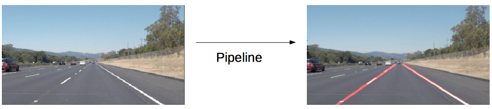
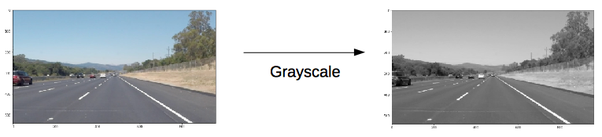
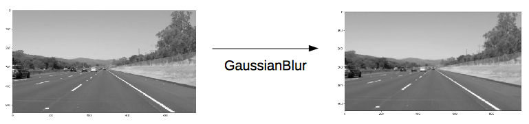
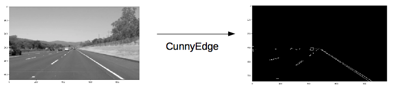
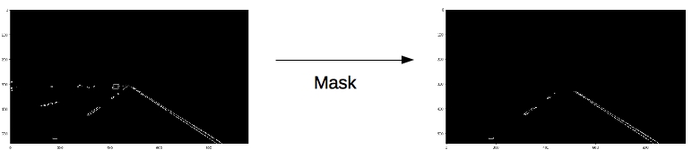
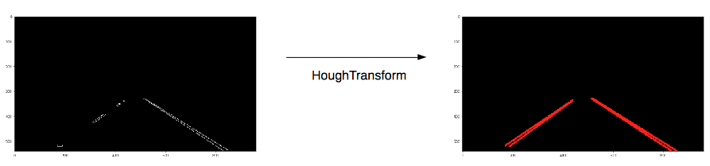
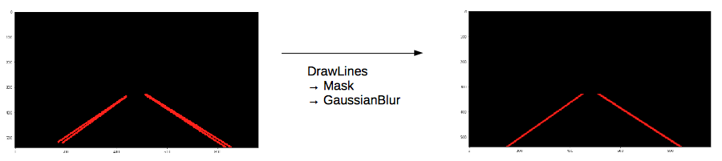
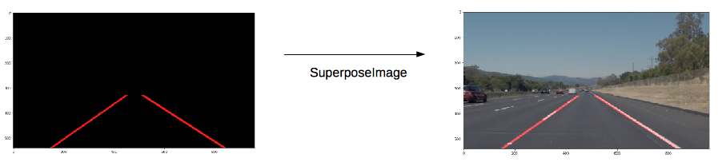

# Finding Lane Lines on the Road

## Pipeline

My pipeline is composed of 7 steps:

1. Transform the input image into a grayscale image:

2. Smooth the grayscale image using a Gaussian Blur. 

3. Find the edges using the Cunny algorithm. A smoothed image limit the gradient from pixels to pixels: it's useful to get rid of potential outliers.

4. Mask out the region of the image that is useless for finding lanes using a trapeze.

5. Find lines using the Hough Transform. Project the image into the Hough Space, find all intersections that match some criteria fixed by given parameters. Return lines as pairs of points in the image. Here, all lines are drawn for illustration purpose. What is actually done is described in the next step.

6. Given all the Hough lines as pairs of points `((x1,y1),(x2,y2))`, `draw_lines` transforms them into matching pairs of slopes and intersects `[(m,b)]`. Outliers are excluded: those that correspond to unrealistic slopes of the lanes. Given two centroids `((max(m),min(b)),(min(m),max(b)))`, a `KMeans` run on `[(m,b)]` gives two slopes and intersects `(m1,b1)` and `(m2,b2)` that approximate the left and right lines of the lane. These two pairs give two points for each line which are used to draw the left and right lines using `cv2.line`.

7. `weighted_img` is then used to superpose the lines with the original image:

## Shortcomings

1. Finding the parameters by hand is not going to work outside of this exercise. 
2. Finding the parameters relies on human qualitative judgment instead of quantitative measurements.
3. This code is likely to break in most situations: bad weather, car crossing, lacking lines, superposed marking...
4. Searching for straight lines in a world made of curves is not going to work.
5. Without a concept of depth to separate what is near from what is far, the system cannot be used in a 3D world.

## Improvements 

1. Improving the code so that all the human found parameters are self optimised using a feedback loop and objectives.
2. Introducing a notion of depth using for example an other image with an other angle or a radar.
3. Generalising from finding straight lines in a 2D world to curves in a 3D world.
4. Generalising from finding lines to imagining the lane and considering the marking on the road as a mere suggestion: sometimes, the marking may not be there, yet the lane is in the driver's head. Sometimes, the marking does not make sense e.g. temporary markings on top of original markings.

## Optional Challenge

A way to solve the problem by modifying slightly the existing pipeline would be to cut the image is horizontal slices, calling the pipeline on each of the slices, then gluing back together the slices. The effect would be the same as a linear approximation of the curves. Horizontal slices should be taken using a log distribution along the y axis to take into account depth.